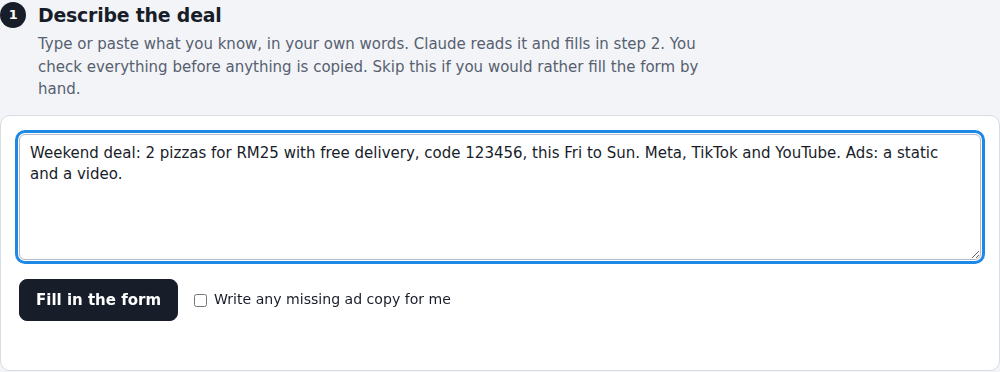
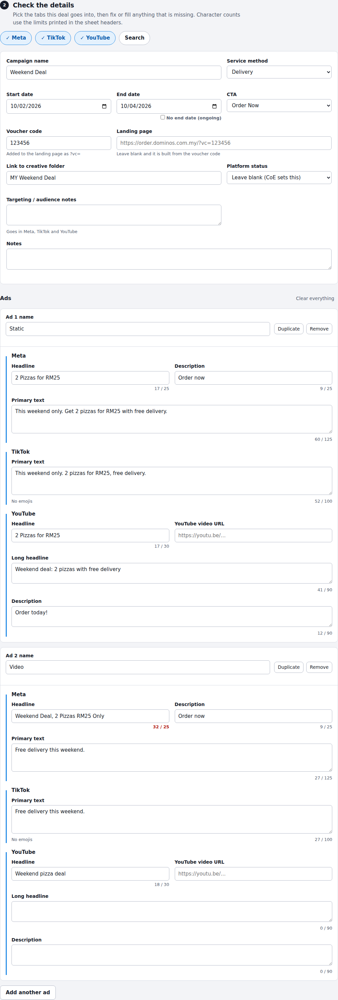
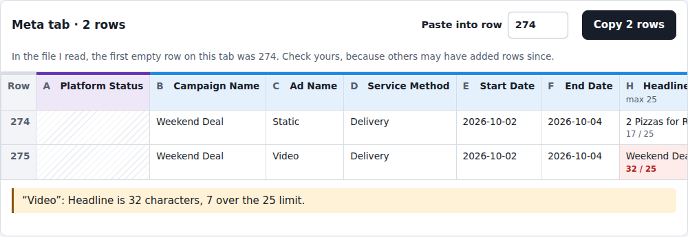

# Rowdy

*Enter a deal once. Get every row.*

Rowdy takes a paid-media deal once and gives you paste-ready rows for every tab (Meta, TikTok, YouTube, Search) of the *Paid Digital Ads Briefing Doc*.

Adding a deal to that sheet used to mean typing the same details four times, into four tabs with four different column layouts. Rowdy asks for the deal once, checks it, and produces one row per ad per tab.



## How it works

1. **Describe the deal** (optional). Type or paste it in plain words. Claude fills in the form.
2. **Check the details.** Pick the tabs, fix anything missing. Character counts use the limits printed in the sheet headers, and problems are flagged (over limit, emoji in TikTok text, missing dates, and so on).
3. **Copy into the sheet.** Press *Copy* on each tab's block, click column A of the row shown in Excel, paste. The character-count columns arrive as `=LEN()` formulas for the right row.




The preview mirrors the sheet's own colour code: **blue** headers are columns MYL fills, **purple** headers are CoE's and are left blank.

## Run it

It is a single static file with no build step and no dependencies.

```bash
# just open it
open index.html            # macOS  (or double-click the file)

# or serve it locally
npm run serve
```

To host it for the team, push the repo to GitHub and turn on **Settings → Pages → Deploy from branch → main / (root)**.

## The plain-language box only works inside Claude

Step 1 uses the `sample` capability of a published Claude artifact (it asks Claude, using the viewer's own Claude account). Outside claude.ai there is no such thing, so on GitHub Pages or a local file the box is disabled with a short message, and **everything else still works**: the form, checks, preview and copy.

To show step 1 working, demo it from the published Claude artifact link. To make it work on your own hosting, you would add a small server that calls the Anthropic API with a key kept server-side, and point `aiGo`'s handler at it. That is not built here.

## What it does not do

- **It does not write to the spreadsheet.** It produces text you paste. That is deliberate: the sheet is shared, and a web page cannot edit a file on SharePoint or Drive.
- **It does not know the next empty row.** `DEFAULT_ROWS` in `index.html` holds the first empty row per tab *as of the file it was built from*. People must check and change the number in the "Paste into row" box.
- **It does not store anything.** No cookies, no local storage, no analytics. The only thing that leaves the page is the text sent to Claude when you press *Fill in the form*.

## Files

| Path | What it is |
| --- | --- |
| `index.html` | The whole tool: styles, logic and UI in one file |
| `tests/core.test.js` | Tests for the logic between the `CORE-START` / `CORE-END` markers |
| `tests/check_headers.py` | Compares the tool's columns with the real spreadsheet |
| `docs/DEMO.md` | A 5-minute script for showing it to colleagues |

## Tests

```bash
npm test                                            # needs Node 18+
python3 tests/check_headers.py path/to/sheet.xlsx   # needs openpyxl
```

Run `check_headers.py` whenever someone adds, moves or renames a column in the sheet. If it reports a mismatch, update `buildSpecs()` in `index.html`.

## Changing the rules

All the sheet-specific settings sit at the top of the `CORE` block in `index.html`:

| Setting | What it controls |
| --- | --- |
| `buildSpecs()` | Column letters, names and character limits for each tab |
| `DEFAULT_ROWS` | First empty row shown per tab |
| `BASE_URL` | Landing page used when there is a voucher code (`?vc=CODE`) |
| `CTA_OPTIONS` | The CTA dropdown (matches the sheet's validation list) |
| `valuesFor()` | Which deal field goes into which column |

## Do not commit the spreadsheet


## Ideas for next steps

- Write rows straight into the workbook: Claude for Excel, an Office Script with Power Automate, or a Google Apps Script if the sheet moves to Google Sheets.
- Read the sheet to fill in the next empty row automatically.
- Optional server so the plain-language box works outside claude.ai.
